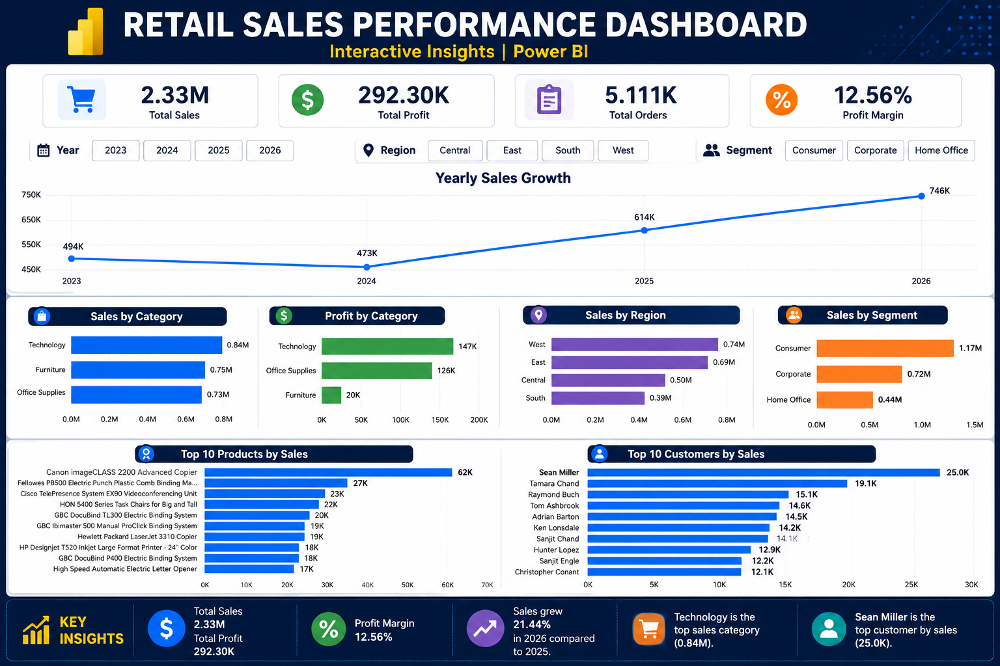

# Retail Sales Performance Analysis

An end-to-end retail sales data analysis project using **Excel, SQL, and Power BI** to uncover sales trends, profitability, customer performance, product performance, regional insights, and business trends.

## 📊 Dashboard Preview



## 📌 Project Overview

This project analyzes retail sales data to identify key business trends and performance drivers.

The analysis focuses on:

- Overall sales performance
- Profitability and profit margin
- Yearly sales trends
- Product category performance
- Regional sales performance
- Customer segment performance
- Top-performing products
- Top-performing customers

The project demonstrates an end-to-end data analysis workflow, from data preparation and SQL analysis to interactive dashboard development in Power BI.

## 🎯 Business Questions

This project aims to answer the following business questions:

1. What is the overall sales and profit performance?
2. How have sales changed over the years?
3. Which product categories generate the highest sales and profit?
4. Which regions contribute the most to total sales?
5. Which customer segments generate the highest revenue?
6. What are the top-selling products?
7. Who are the highest-value customers?

## 🛠️ Tools & Technologies

- **Microsoft Excel** – Data preparation and initial exploration
- **SQL** – Data querying and business analysis
- **Power BI** – Data visualization and interactive dashboard development
- **DAX** – KPI and profit margin calculations

## 📈 Key Performance Indicators

| KPI | Result |
|---|---:|
| Total Sales | 2.33M |
| Total Profit | 292.30K |
| Total Orders | 5.111K |
| Profit Margin | 12.56% |

## 🔍 Key Insights

### Sales Trend

- Sales reached approximately **494K in 2023**.
- Sales decreased slightly to approximately **473K in 2024**.
- Sales increased significantly to approximately **614K in 2025**.
- Sales reached approximately **746K in 2026**, the highest level in the analyzed period.
- Sales grew approximately **21.44% from 2025 to 2026**.

### Category Performance

- **Technology** generated the highest sales at approximately **0.84M**.
- Technology also generated the highest profit at approximately **147K**.
- **Furniture** generated approximately **0.75M** in sales but only around **20K** in profit.
- **Office Supplies** generated approximately **0.73M** in sales and **126K** in profit.

### Regional Performance

- **West** was the strongest region with approximately **0.74M** in sales.
- **East** followed with approximately **0.69M**.
- **Central** generated approximately **0.50M**.
- **South** recorded the lowest sales at approximately **0.39M**.

### Customer Segment Performance

- **Consumer** was the largest customer segment with approximately **1.17M** in sales.
- **Corporate** generated approximately **0.72M**.
- **Home Office** generated approximately **0.44M**.

### Product & Customer Performance

- **Canon imageCLASS 2200 Advanced Copier** was the highest-selling product at approximately **62K**.
- **Sean Miller** was the highest-value customer with approximately **25K** in sales.

## 💡 Business Recommendations

Based on the analysis:

- Continue investing in the **Technology** category due to its strong sales and profitability.
- Investigate the low profitability of **Furniture** despite its relatively high sales.
- Focus marketing and sales strategies on the **West and East regions**, while identifying opportunities to improve performance in the South.
- Prioritize the **Consumer segment**, which contributes the largest share of sales.
- Strengthen relationships with high-value customers and analyze their purchasing patterns for retention and upselling opportunities.
- Monitor high-performing products to maintain availability and support inventory planning.

## 📊 Dashboard Features

The Power BI dashboard includes:

- Total Sales KPI
- Total Profit KPI
- Total Orders KPI
- Profit Margin KPI
- Year filter
- Region filter
- Customer Segment filter
- Yearly Sales Growth
- Sales by Category
- Profit by Category
- Sales by Region
- Sales by Segment
- Top 10 Products by Sales
- Top 10 Customers by Sales

## 🧮 DAX Measure

Profit Margin was calculated using:

```DAX
Profit Margin =
DIVIDE(
    SUM(Orders[Profit]),
    SUM(Orders[Sales]),
    0
)
